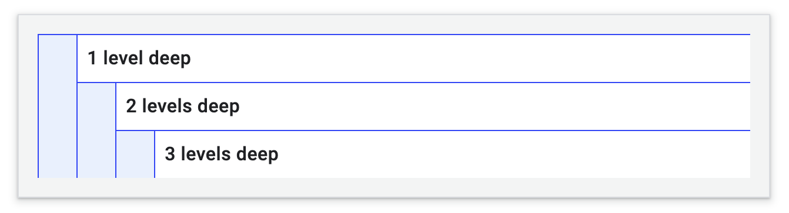
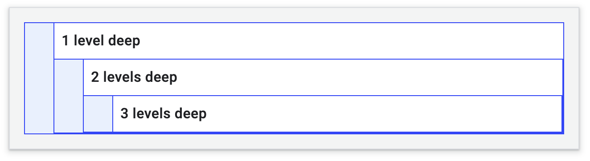
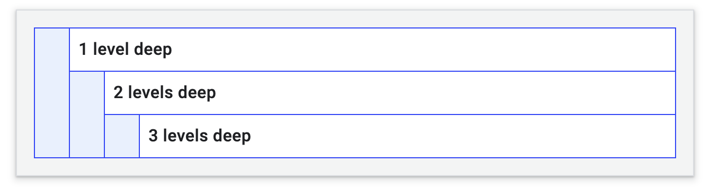
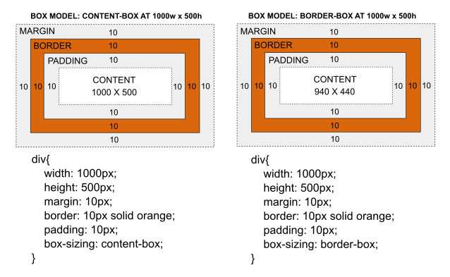

# CSS

CSS exercises following the [Learn CSS] module.

## Table of Contents

- [CSS](#css)
  - [Table of Contents](#table-of-contents)
  - [Selectors](#selectors)
    - [Pseudo-classes](#pseudo-classes)
    - [Pseudo-elements](#pseudo-elements)
    - [Complex Selectors](#complex-selectors)
      - [Descendent Combinators](#descendent-combinators)
      - [Child Combinators](#child-combinators)
      - [Sibling Combinators](#sibling-combinators)
      - [General Sibling Combinators](#general-sibling-combinators)
    - [Readings](#readings)
  - [Box Model](#box-model)
    - [Extrinsic Sizing vs Intrinsic Sizing](#extrinsic-sizing-vs-intrinsic-sizing)
    - [Areas of Box Model](#areas-of-box-model)
    - [Readings](#readings-1)
  - [References](#references)

## Selectors

A CSS selector maps to an HTML element and apply styles to it.

1. Universal selector

```CSS
* {
  color: blue;
}
```

2. Type selector

```CSS
article {
  color: blue;
}
```

3. Class selector

```CSS
.my-class {
  color: blue;
}
```

4. ID selector

```CSS
#my-id {
  color: blue;
}
```

5. Attribute selector

```CSS
[my-attr='certain-value'] {
  color: orange;
}
```

We can add `s` to a case-sensitive attribute selector or do the opposite-case insensitivity by adding `i`.

```CSS
[my-aTtr='cErTain-Value' s] {
  color: orange;
}
```

Specifying an attribute selector under a specific HTML element.

```CSS
p[my-attr='certain-value'] {
  font-size: 1.2em;
}
```

Three options to match portions of values.

```CSS
/* A href that contains "example.com" */
[href*='example.com'] {
  color: red;
}

/* A href that starts with https */
[href^='https'] {
  color: green;
}

/* A href that ends with .com */
[href$='.com'] {
  color: blue;
}
```

Any element that has an `id` attribute must have a unique value for it. The best practice is not to use ID selectors but instead, use class selectors to reuse CSS.

### Pseudo-classes

### Pseudo-elements

### Complex Selectors

#### Descendent Combinators

For example, the HTML elements can have descendent combinators `.top div p div p div p`. A space separates parent selectors and their child selectors.

```HTML
<div class="top box">
  <div>
    <p>1 level deep</p>
    <div>
      <p>2 levels deep</p>
      <div>
        <p>3 levels deep</p>
      </div>
    </div>
  </div>
</div>
```

```CSS
.top div {
  padding-left: 2em;
  background: #fff;
  border-top: 1px solid blue;
  border-left: 1px solid blue;
}
```

The layout becomes as follows:

</img>

As descendent selectors are recursive, it affects all the children. That is why the following example has overlapped borders.

</img>

```CSS
.top div {
  border-bottom: 1px solid blue;
  border-right: 1px solid blue;
}
```

#### Child Combinators

We add a character between selectors to specify the items based on their position to address such issues. `>` refers to the first descendent in the hierarchy.

```CSS
.top > div {
  border-bottom: 1px solid blue;
  border-right: 1px solid blue;
}
```

The layout becomes as follows:

</img>

#### Sibling Combinators

The syntax of sibling combinators is `former_element + target_element { style properties }` [\[3\]]. For example,

```CSS
/* Paragraphs that come immediately after any image */
img + p {
  font-weight: bold;
}
```

Below is another example. It lexically refers to anything that comes after anything under the `top` class. That implies all elements except for the first child.

```CSS
.top * + * {
  margin-top: 1.5em;
}
```

#### General Sibling Combinators

A general sibling combinator selects siblings that come anywhere after a given element. For example, we want to select all the `p` tag after `h1` in the given HTML below.

```HTML
<article>
    <p>A normal paragraph</p>
    <div>
      <h1>A heading</h1>
      <p>I am a red paragraph.</p>
      <div>I am a div</div>
      <p>I am another red paragraph.</p>
    </div>
    <p>A normal paragraph</p>
</article>
```

```CSS
h1 ~ p {
    color: red;
}
```

### Readings

-   [Selectors](https://web.dev/learn/css/selectors/)
-   [CodePen: basic selectors](https://codepen.io/catherine22-the-reactor/pen/KKvRzyM)
-   [CodePen: child combinators](https://codepen.io/catherine22-the-reactor/pen/yLojJLz)
-   [CodePen: sibling combinators](https://codepen.io/catherine22-the-reactor/pen/BadxLRV)

## Box Model

### Extrinsic Sizing vs Intrinsic Sizing

By using extrinsic sizing, there is a limit of how much child content can add before it overflows out of the parent's bounds. For example, adding `width: 320px;` to a CSS component makes it extrinsically sized. The problem with the extrinsic sizing is that the child overflows outside of the parent's box if its content is too large for the parent.

```CSS
.parent {
	width: 400px;
	height: 400px;
}
```

Adding `width: min-content` to the parent tells the box only to be as wide as the intrinsic minimum width of its content so that the box can fit its content. Therefore, the browser determines the size of a box.

```CSS
.parent {
	  width: min-content;
	  height: min-content;
}
```

`min-content` is the smallest box size where its contents do not overflow outside the box. The `max-content` sizing keyword represents the intrinsic maximum width or height of the content. For text content, this means that the content will not wrap at all, even if it causes overflows [\[1\]].

### Areas of Box Model

The image below shows relevant CSS properties:

 [\[2\]]

Read [MDN Web Docs](https://developer.mozilla.org/en-US/docs/Web/CSS/box-sizing) carefully and compare `box-sizing: content-box;` and `box-sizing: border-box;`.

### Readings

-   [How do min-content and max-content work?]
-   [Box Model](https://web.dev/learn/css/box-model/)
-   [CodePen](https://codepen.io/catherine22-the-reactor/pen/dyzeorr?editors=0010)

## References

-   [Learn CSS]
-   [CodePen collection](https://codepen.io/collection/mrPRmj)
-   [A Modern CSS Reset]

[learn css]: https://web.dev/learn/css/
[how do min-content and max-content work?]: https://stackoverflow.com/questions/51285308/how-do-min-content-and-max-content-work
[a modern css reset]: ./reset.css
[\[1\]]: https://developer.mozilla.org/en-US/docs/Web/CSS/max-content
[\[2\]]: https://stackoverflow.com/questions/46923610/css-resetting-margin-and-padding
[\[3\]]: https://developer.mozilla.org/en-US/docs/Web/CSS/Adjacent_sibling_combinator
