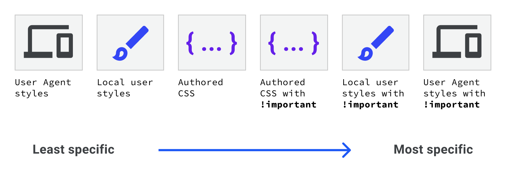
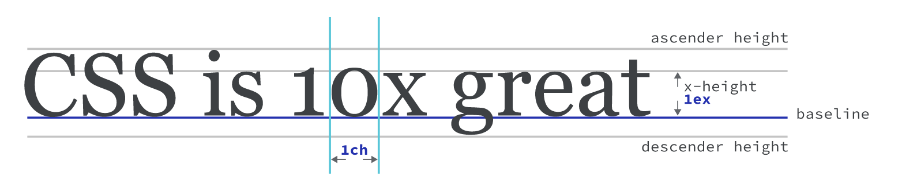
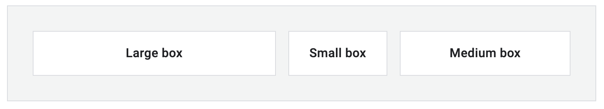
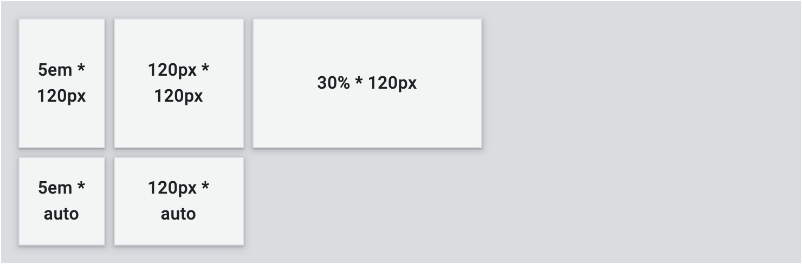

# CSS

CSS exercises following the [Learn CSS] module.

## Table of Contents

- [CSS](#css)
  - [Table of Contents](#table-of-contents)
  - [Selectors](#selectors)
    - [Pseudo-classes](#pseudo-classes)
    - [Pseudo-elements](#pseudo-elements)
    - [Complex Selectors](#complex-selectors)
      - [Descendent Combinators](#descendent-combinators)
      - [Child Combinators](#child-combinators)
      - [Sibling Combinators](#sibling-combinators)
      - [General Sibling Combinators](#general-sibling-combinators)
    - [Readings](#readings)
  - [Box Model](#box-model)
    - [Extrinsic Sizing vs Intrinsic Sizing](#extrinsic-sizing-vs-intrinsic-sizing)
    - [Areas of Box Model](#areas-of-box-model)
    - [Readings](#readings-1)
  - [Cascade](#cascade)
    - [Rule 1: Position and Order of Appearance](#rule-1-position-and-order-of-appearance)
    - [Rule 2: Specificity](#rule-2-specificity)
    - [Rule 3: Origins](#rule-3-origins)
    - [Readings](#readings-2)
  - [Specificity](#specificity)
    - [Universal Selector: 0 Points](#universal-selector-0-points)
    - [Type Selector, Pseudo-element Selector: 1 point](#type-selector-pseudo-element-selector-1-point)
    - [Class Selector, Pseudo-class Selector, Attribute Selector: 10 Points](#class-selector-pseudo-class-selector-attribute-selector-10-points)
    - [ID Selector: 100 Points](#id-selector-100-points)
    - [Inline Style Attribute: 1,000 Points](#inline-style-attribute-1000-points)
    - [The `!important` keyword: 10, 000 Points](#the-important-keyword-10-000-points)
    - [Combination of Selectors](#combination-of-selectors)
    - [Readings](#readings-3)
  - [Inheritance](#inheritance)
    - [Readings](#readings-4)
  - [Sizing Units](#sizing-units)
    - [Readings](#readings-5)
  - [Layout](#layout)
    - [Inline](#inline)
    - [Block](#block)
    - [Flexbox](#flexbox)
    - [Main Axis and Cross Axis](#main-axis-and-cross-axis)
    - [Wrapping flex items](#wrapping-flex-items)
    - [The `flex-flow` Property](#the-flex-flow-property)
    - [The `flex` Property](#the-flex-property)
    - [Ordering flex items](#ordering-flex-items)
    - [Alignment](#alignment)
    - [Readings](#readings-6)
  - [Grid](#grid)
    - [Terminology](#terminology)
    - [Examples](#examples)
    - [Readings](#readings-7)
  - [References](#references)

## Selectors

A CSS selector maps to an HTML element and apply styles to it.

1. Universal selector

```CSS
* {
  color: blue;
}
```

2. Type selector

```CSS
article {
  color: blue;
}
```

3. Class selector

```CSS
.my-class {
  color: blue;
}
```

4. ID selector

```CSS
#my-id {
  color: blue;
}
```

5. Attribute selector

```CSS
[my-attr='certain-value'] {
  color: orange;
}
```

We can add `s` to a case-sensitive attribute selector or do the opposite-case insensitivity by adding `i`.

```CSS
[my-aTtr='cErTain-Value' s] {
  color: orange;
}
```

Specifying an attribute selector under a specific HTML element.

```CSS
p[my-attr='certain-value'] {
  font-size: 1.2em;
}
```

Three options to match portions of values.

```CSS
/* A href that contains "example.com" */
[href*='example.com'] {
  color: red;
}

/* A href that starts with https */
[href^='https'] {
  color: green;
}

/* A href that ends with .com */
[href$='.com'] {
  color: blue;
}
```

Any element that has an `id` attribute must have a unique value for it. The best practice is not to use ID selectors but instead, use class selectors to reuse CSS.

### Pseudo-classes

### Pseudo-elements

### Complex Selectors

#### Descendent Combinators

For example, the HTML elements can have descendent combinators `.top div p div p div p`. A space separates parent selectors and their child selectors.

```HTML
<div class="top box">
  <div>
    <p>1 level deep</p>
    <div>
      <p>2 levels deep</p>
<div>
        <p>3 levels deep</p>
      </div>
    </div>
  </div>
</div>
```

```CSS
.top div {
  padding-left: 2em;
  background: #fff;
  border-top: 1px solid blue;
  border-left: 1px solid blue;
}
```

The layout becomes as follows:

</img>

As descendent selectors are recursive, it affects all the children. That is why the following example has overlapped borders.

</img>

```CSS
.top div {
  border-bottom: 1px solid blue;
  border-right: 1px solid blue;
}
```

#### Child Combinators

We add a character between selectors to specify the items based on their position to address such issues. `>` refers to the first descendent in the hierarchy.

```CSS
.top > div {
  border-bottom: 1px solid blue;
  border-right: 1px solid blue;
}
```

The layout becomes as follows:

</img>

#### Sibling Combinators

The syntax of sibling combinators is `former_element + target_element { style properties }` [\[3\]]. For example,

```CSS
/* Paragraphs that come immediately after any image */
img + p {
  font-weight: bold;
}
```

Below is another example. It lexically refers to anything that comes after anything under the `top` class. That implies all elements except for the first child.

```CSS
.top * + * {
  margin-top: 1.5em;
}
```

#### General Sibling Combinators

A general sibling combinator selects siblings that come anywhere after a given element. For example, we want to select all the `p` tag after `h1` in the given HTML below.

```HTML
<article>
    <p>A normal paragraph</p>
    <div>
      <h1>A heading</h1>
      <p>I am a red paragraph.</p>
<div>I am a div</div>
      <p>I am another red paragraph.</p>
    </div>
    <p>A normal paragraph</p>
</article>
```

```CSS
h1 ~ p {
    color: red;
}
```

### Readings

-   [Selectors](https://web.dev/learn/css/selectors/)
-   [CodePen: basic selectors](https://codepen.io/catherine22-the-reactor/pen/KKvRzyM)
-   [CodePen: child combinators](https://codepen.io/catherine22-the-reactor/pen/yLojJLz)
-   [CodePen: sibling combinators](https://codepen.io/catherine22-the-reactor/pen/BadxLRV)

## Box Model

### Extrinsic Sizing vs Intrinsic Sizing

By using extrinsic sizing, there is a limit of how much child content can add before it overflows out of the parent's bounds. For example, adding `width: 320px;` to a CSS component makes it extrinsically sized. The problem with the extrinsic sizing is that the child overflows outside of the parent's box if its content is too large for the parent.

```CSS
.parent {
  width: 400px;
  height: 400px;
}
```

Adding `width: min-content` to the parent tells the box only to be as wide as the intrinsic minimum width of its content so that the box can fit its content. Therefore, the browser determines the size of a box.

```CSS
.parent {
  width: min-content;
  height: min-content;
}
```

`min-content` is the smallest box size where its contents do not overflow outside the box. The `max-content` sizing keyword represents the intrinsic maximum width or height of the content. For text content, this means that the content will not wrap at all, even if it causes overflows [\[1\]].

### Areas of Box Model

The image below shows relevant CSS properties:

 [\[2\]]

Read [MDN Web Docs](https://developer.mozilla.org/en-US/docs/Web/CSS/box-sizing) carefully and compare `box-sizing: content-box;` and `box-sizing: border-box;`.

### Readings

-   [How do min-content and max-content work?]
-   [Box Model](https://web.dev/learn/css/box-model/)
-   [CodePen](https://codepen.io/catherine22-the-reactor/pen/dyzeorr)

## Cascade

**_Cascade_** is an algorithm that solves conflicts where multiple CSS rules apply to an HTML element. The algorithm is split into four distinct stages: [\[4\]]

1. Position and order of appearance
2. Specificity
3. Origin
4. Importance

### Rule 1: Position and Order of Appearance

The colour of the button is blue in all cases below.

1. Scenario 1: Two attributes in one selector.

```CSS
button {
  color: red;
  color: blue;
}
```

2. Scenario 2: Two selectors in order.

```CSS
button {
  color: red;
}

button {
  color: blue;
}
```

3. Scenario 3: Two links in order.

In your HTML file, you add two links.

```HTML
<link rel="stylesheet" href="https://codepen.io/my-awesome-css/pen/button1.css" />
<link rel="stylesheet" href="https://codepen.io/my-awesome-css/pen/button2.css" />
```

In button1.css, you we have

```CSS
button {
  color: red;
}
```

In button2.css, you we have

```CSS
button {
  color: blue;
}
```

4. Scenario 4: One link and one CSS selector

```HTML
<link rel="stylesheet" href="./style.css" />
<link rel="stylesheet" href="https://codepen.io/my-awesome-css/pen/button2.css" />
```

In style.css, we have

```CSS
button {
  color: red;
}
```

In button2.css, we have

```CSS
button {
  color: blue;
}
```

### Rule 2: Specificity

```HTML
<h1 id="my-id" class="my-element" data-type="heading">Heading</h1>
```

```CSS
* {
    color: yellow;
}
#my-id {
    color: blue;
}

.my-element {
    color: red;
}

[data-type='heading'] {
    color: green;
}

h1 {
    color: black;
}
```

The colour of the heading is blue, because the priority of CSS selectors are **ID selector > class selector > type selector > attribute selector > universal selector**.

Go to the [Specificity](#specificity) section to learn more.

### Rule 3: Origins

[\[5\]]

User agent styles are the browser's default styles. Local user styles are OS-level styles like font size or browser extensions that allow users to customise CSS for the current website. Authored CSS is a website's CSS.

### Readings

-   [CSS Cascade](https://web.dev/learn/css/the-cascade/)
-   [CSS Specificity](https://web.dev/learn/css/specificity/)

## Specificity

### Universal Selector: 0 Points

A universal selector has no specificity.

```CSS
* {
  color: red;
}
```

### Type Selector, Pseudo-element Selector: 1 point

```CSS
div {
  color: red;
}
```

```CSS
::selection {
  color: red;
}
```

### Class Selector, Pseudo-class Selector, Attribute Selector: 10 Points

```CSS
.my-class {
  color: red;
}
```

```CSS
:hover {
  color: red;
}
```

```CSS
[href='#'] {
  color: red;
}
```

### ID Selector: 100 Points

```CSS
#myID {
  color: red;
}

```

### Inline Style Attribute: 1,000 Points

```CSS
<div style="color: red"></div>
```

### The `!important` keyword: 10, 000 Points

```CSS
.my-class {
  color: red !important; /* 10,000 points */
  background: white; /* 10 points */
}
```

### Combination of Selectors

The type selector `div` gets 1 point and the pseudo-class selector `not` gets 10 points. Hence, this sample has 11 points of specificity.

```CSS
div:not(.my-class) {
  color: red;
}
```

11 Points of specificity.

```CSS
a[href="#"] {
  color: red;
}
```

Given a HTML:

```HTML
<a class="my-class another-class" href="#">A link</a>
```

```CSS

/* Q1 */
a {
  color: red;
}

/* Q2 */
a.my-class {
  color: green;
}

/* Q3 */
a.my-class.another-class {
  color: rebeccapurple;
}

/* Q4 */
a.my-class.another-class[href] {
  color: goldenrod;
}

/* Q5 */
a.my-class.another-class[href]:hover {
  color: lightgrey;
}
```

The specificity of each quiz is listed below:

-   Q1: 1 (1 type selector)
-   Q2: 11 (1 type selector + 1 class selector)
-   Q3: 21 (1 type selector + 2 class selectors)
-   Q4: 31 (1 type selector + 2 class selectors + 1 attribute selector)
-   Q5: 41 (1 type selector + 2 class selectors + 1 attribute selector + 1 pseudo-class selector)

### Readings

-   [CSS Specificity](https://web.dev/learn/css/specificity/)

## Inheritance

With the `inherit` keyword, the child inherit CSS from its parent. Not all CSS properties are inheritable, check out [Inheritable CSS Properties] to review all inheritable CSS Properties.

### Readings

-   [CodePen](https://codepen.io/catherine22-the-reactor/pen/oNedKWL)

## Sizing Units

 [\[6\]]

Go to [Font-size-relative units](https://web.dev/learn/css/sizing/#font-size-relative-units) and [Viewport-relative units ](https://web.dev/learn/css/sizing/#viewport-relative-units) to see all available relative font-size units and view-size units, respectively.

### Readings

-   [Sizing Units]
-   [CodePen](https://codepen.io/catherine22-the-reactor/pen/BadVOOr)

## Layout

### Inline

Inline elements behave like words in a sentence. They sit next to each other in the inline direction.

You can't set an explicit width and height on inline elements. Any block level margin and padding will be ignored by the surrounding elements [\[7\]].

### Block

Block elements don't sit alongside each other. They create a new line for themselves [\[7\]].

### Flexbox

**_Flexbox_** is a layout mechanism designed for laying out groups of items in one dimension [\[8\]].

Given a parent component and three children as follows:

```HTML
<div class="content">
  <p>Paragraph A</p>
  <p>Paragraph B</p>
  <p>Paragraph C</p>
</div>
```

```CSS
.content {
  display: flex;
}
```

The three paragraphs are arranged in a horizontal row.

```CSS
| Paragraph A | Paragraph B | Paragraph C |
```

### Main Axis and Cross Axis

Children components can be arranged in a vertical column by setting the `flex-direction` property as `column`.

```CSS
.content {
  display: flex;
  flex-direction: column;
}
```

```CSS
| Paragraph A |
| Paragraph B |
| Paragraph C |
```

The main axis is the direction set by the flex-direction property. The cross axis runs in the other direction to the main axis. For example, if the main axis is `column`, the cross axis runs along the `row`.

### Wrapping flex items

By default, the flex direction of flexbox is `nowrap`. If there is not enough space in the container, the items will overflow.

```CSS
.container {
  display: flex;
  flex-wrap: nowrap;
}
```

Flex items can be squeezed to the new line to next line depending on the flex direction and the space of its container.

```CSS
.container {
  display: flex;
  flex-wrap: wrap;
}
```

### The `flex-flow` Property

The shorthand `flex-flow` is a combination of `flex-direction` and `flex-wrap`. For example, the following two piece of CSS are equivalent.

```CSS
.container {
  display: flex;
  flex-direction: column;
  flex-wrap: wrap;
}
```

```CSS
.container {
  display: flex;
  flex-flow: column wrap;
}
```

### The `flex` Property

Use the `flex` or `flex-` properties to control the space inside flex items. For example,

```CSS
.container {
  display: flex;
  gap: 1em;
}

.item:first-child {
  flex: 3;
}

.item:nth-child(2) {
  flex: 1;
}

.item:nth-child(3) {
  flex: 2;
}
```



Go to [Controlling space inside flex items](https://web.dev/learn/css/flexbox/#controlling-space-inside-flex-items) to read more properties with the `flex-` prefix.

### Ordering flex items

You can order flex items by adding the `order` property. Notice, no need to add `order: 1`.

```CSS
.container {
  display: flex;
  gap: 1em;
}

.item:first-child {
  order: 3;
}

.item:nth-child(2) {
  /* no order: 1; */
}

.item:nth-child(3) {
  order: 2;
}
```

You will get

```
item 2 | item 3 | item 1
```

### Alignment

-   `justify-content`: space distribution on the main axis (the value of your flex-direction).
-   `align-content`: space distribution on the cross axis.
-   `place-content`: a shorthand for setting both of the above properties.

Go to [Flexbox alignment overview](https://web.dev/learn/css/flexbox/#flexbox-alignment-overview) to read more.

### Readings

-   [Flexbox]
-   [CodePen](https://codepen.io/catherine22-the-reactor/pen/LYjrgqm)

## Grid

### Terminology

Go to [Grid terminology] to learn what lines, tracks, cells, areas and gaps are.

### Examples

There are five use cases for the grid. Each example provides the most significant part of the code. Source code is available at [CodePen](https://codepen.io/catherine22-the-reactor/pen/MWvBOLr).

1. Draw a grid with 3-column tracks and 2-row tracks. Each cell has a different size.

[\[9\]]

```HTML
<div class="container simple-grid">
  <div class="box">5em * 120px</div>
  <div class="box">120px * 120px</div>
  <div class="box">30% * 120px</div>
  <div class="box">5em * auto</div>
  <div class="box">120px * auto</div>
</div>
```

```CSS
.container {
  display: grid;
}

.simple-grid {
  grid-template-columns: 5em 120px 30%;
  grid-template-rows: 120px auto;
  gap: 8px;
}
```

2. Draw an intrinsic sizing grid with 3-column tracks and 2-row tracks, and make sure its track content will not overflow.
    1. The `fit-content(size)` property fits the content and place child items evenly. You will need `fit-content(size)`.
    2. The `auto` property stretches items automatically to fit the content.
    3. `min-content` and `max-content` properties ensure the child item has a minimum size and enough space without squeeze content, respectively, even though the items may overflow.

```HTML
<div class="container intrinsic-sizing">
  <div class="box">Box</div>
  <div class="box">Box</div>
  <div class="box">Box</div>
  <div class="box">Box</div>
  <div class="box">Box</div>
</div>
```

```CSS
.intrinsic-sizing {
  grid-template-columns: repeat(3, min-content);
  grid-template-rows: 120px auto;
  gap: 8px;
}

/*
Other available intrinsic sizing options:

grid-template-columns: repeat(3, min-content);
grid-template-columns: repeat(3, max-content);
grid-template-columns: repeat(3, fit-content(5em));
grid-template-columns: repeat(3, auto);
*/
```

3. Draw a grid with 3-column tracks and 2-row tracks. The width ratio of items in a row should be 1:3:2.

```CSS
.fr {
  grid-template-columns: 1fr 3fr 2fr;
  grid-template-rows: 120px auto;
  gap: 8px;
}
```

`fr` is a special unit used in gird.

4. Draw a grid with 3-column tracks and 2-row tracks. The last item in a row has the maximum size `2fr`. With the `minmax()`, the item can be stretched automatically while there is enough space.

```CSS
.min-max {
  grid-template-columns: 1fr 2fr minmax(auto, 2fr);
  grid-template-rows: 120px auto;
  gap: 8px;
}
```

5. Draw a grid with 5-column tracks and 3-row tracks. Each child item has the same size.

```HTML
<div class="container repeat">
  <div class="box">Box</div>
  <div class="box">Box</div>
  <div class="box">Box</div>
  <div class="box">Box</div>
  <div class="box">Box</div>
  <div class="box">Box</div>
  <div class="box">Box</div>
  <div class="box">Box</div>
  <div class="box">Box</div>
  <div class="box">Box</div>
  <div class="box">Box</div>
</div>
```

6. Add fixed size tracks and fill with items as many as possible without overflowing the container.

### Readings

-   [Grid]
-   [CodePen](https://codepen.io/catherine22-the-reactor/pen/MWvBOLr)

## References

-   [Learn CSS]
-   [CodePen collection](https://codepen.io/collection/mrPRmj)
-   [A Modern CSS Reset]

[learn css]: https://web.dev/learn/css/
[how do min-content and max-content work?]: https://stackoverflow.com/questions/51285308/how-do-min-content-and-max-content-work
[a modern css reset]: ./reset.css
[inheritable css properties]: https://web.dev/learn/css/inheritance/#which-properties-are-inheritable
[sizing units]: https://web.dev/learn/css/sizing/
[flexbox]: https://web.dev/learn/css/flexbox/
[grid terminology]: https://web.dev/learn/css/grid/#grid-terminology
[grid]: https://web.dev/learn/css/grid/
[\[1\]]: https://developer.mozilla.org/en-US/docs/Web/CSS/max-content
[\[2\]]: https://stackoverflow.com/questions/46923610/css-resetting-margin-and-padding
[\[3\]]: https://developer.mozilla.org/en-US/docs/Web/CSS/Adjacent_sibling_combinator
[\[4\]]: https://web.dev/learn/css/the-cascade/
[\[5\]]: https://web.dev/learn/css/the-cascade/#origin
[\[6\]]: https://web.dev/learn/css/sizing/#font-size-relative-units
[\[7\]]: https://web.dev/learn/css/layout/
[\[8\]]: https://web.dev/learn/css/flexbox/
[\[9\]]: https://web.dev/learn/css/grid/

