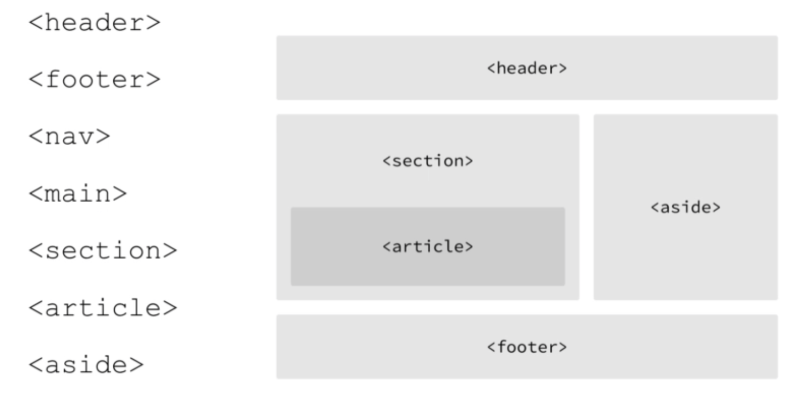

# HTML

HTML is the content of web pages, not a programming language. HTML has limited styling; that's why CSS comes in. CSS, known as Cascading Style Sheets, is a styling/stylesheet language decorating HTML files.

You can press `command` + `option` + `U` to view the HTML source code of web pages on Chrome.

## Table of Contents

- [HTML](#html)
  - [Table of Contents](#table-of-contents)
  - [HTML Tags](#html-tags)
    - [HTML boilerplate](#html-boilerplate)
    - [`<head>`](#head)
    - [`<body>`](#body)
      - [Headings and paragraph](#headings-and-paragraph)
      - [Links](#links)
      - [Images](#images)
      - [Lists](#lists)
      - [Tables](#tables)
      - [Forms](#forms)
    - [HTML elements](#html-elements)
      - [id vs name](#id-vs-name)
      - [HTML entities](#html-entities)
      - [HTML semantic Tags](#html-semantic-tags)
  - [References](#references)

## HTML Tags

### HTML boilerplate

`<!DOCTYPE html>`: The very first thing in your HTML file. There are variations in the HTML files. The document type tag tells the browser what type of HTML this file is.

In VS Code, you can type in `!` to quickly generate an HTML boilerplate.

```HTML
<!DOCTYPE html>
<html lang="en">
    <head>
        <meta charset="UTF-8" />
        <meta http-equiv="X-UA-Compatible" content="IE=edge" />
        <meta name="viewport" content="width=device-width, initial-scale=1.0" />
         <meta name="description" content="say something">
        <title>Document</title>
    </head>
    <body></body>
</html>
```

### `<head>`

```HTML
<!DOCTYPE html>
<html lang="en">
    <head>
        <meta charset="UTF-8" />
        <meta http-equiv="X-UA-Compatible" content="IE=edge" />
        <!--The viewport meta is essential for responsive design. The content here means that the entire page will be shown on the screen.-->
        <meta name="viewport" content="width=device-width, initial-scale=1.0" />

        <!-- SEO -->
        <meta name="description" content="say something">
        <meta name="keywords" content="keyword1, keyword2, ...">

        <!-- uncomment the robots meta if you don't want your website to be shown up in search results -->
        <!-- <meta name="robots" content="NOINDEX, NOFOLLOW"> -->

        <!-- Your title will be displayed on the tab of the browser as well as the search results. -->
        <title>Document</title>
    </head>
    <body></body>
</html>

```

### `<body>`

#### Headings and paragraph

```HTML
<!-- headings -->
<h1>heading 1</h1>
<h2>heading 2</h2>
<h3>heading 3</h3>
<h4>heading 4</h4>
<h5>heading 5</h5>
<h6>heading 6</h6>

<!-- paragraph -->
<p>
    Lorem ipsum dolor sit amet consectetur adipisicing elit. Excepturi
    iste minima
    <strong>BOLD</strong> temporibus dolorem optio voluptates error
    nostrum eaque tenetur, illo eligendi, in consequuntur modi doloribus
    culpa cupiditate aliquam architecto quos! Id ullam cupiditate dolor
    eaque. Voluptatem beatae totam odit <em>EMPHASIS</em> cupiditate
    labore neque eos sapiente quia magnam ea deleniti tempora veniam
    consequuntur iusto error corporis enim, ipsa nisi fugiat. Labore
    aperiam saepe, tenetur animi reiciendis asperiores, veritatis
    <!-- Line break in p tags-->
    <br>
    <br>
    facilis obcaecati alias culpa quaerat in quibusdam iste dolorem
    natus quisquam est rerum inventore maxime quas ipsa tempore.
    Similique reprehenderit magnam harum cum.
    <!-- Horizontal line -->
    <hr>
</p>
```

#### Links

```HTML
<!-- External links -->
<a href="http://www.google.com">Visit Google</a>
<a href="http://www.google.com" target="_blank">
    Visit Google in a new tab
</a>

<!-- Internal links -->
<a href="./page1.html">Visit page 1</a>
```

#### Images

```HTML


```

#### Lists

```HTML
<!-- unordered list -->
<ul style="list-style: circle">
    <li>Item 1</li>
    <li>Item 2</li>
    <li>Item 3</li>
    <li>Item 4</li>
</ul>

<!-- ordered list -->
<ol type="A">
    <li>Item 1</li>
    <li>Item 2</li>
    <li>Item 3</li>
    <li>Item 4</li>
</ol>

<!-- Nested list -->
<ol type="I">
    <li>Item 1</li>
    <li>Item 2</li>
    <ol type="i">
        <li>Subitem 1</li>
        <li>Subitem 2</li>
    </ol>
    <li>Item 3</li>
    <li>Item 4</li>
</ol>
```

#### Tables

| Full name   | Gender | Age |
| ----------- | ------ | --- |
| Sanya Moyer | F      | 10  |
| Tommy Hull  | M      | 8   |

```HTML
<table>
    <!-- heading of the table-->
    <thead>
        <!-- table rows -->
        <tr>
            <!-- columns for the heading-->
            <th>Full name</th>
            <th>Gender</th>
            <th>Age</th>
        </tr>
    </thead>
    <!-- body of the table -->
    <tr>
        <!-- columns for the body-->
        <td>Sanya Moyer</td>
        <td>F</td>
        <td>10</td>
    </tr>
    <tr>
        <!-- columns for the body-->
        <td>Tommy Hull</td>
        <td>M</td>
        <td>8</td>
    </tr>
</table>
```

#### Forms

Single-lined text

```HTML
<form>
    <!-- Single-lined text -->
    <div>
        <label for="name">Name</label>
        <!-- setting up "id" enables users to focus the input field by clicking on the label -->
        <!-- the value of the "id" should be the same as the value of the "for" attribute in <label> -->
        <input type="text" id="name" name="name" />
    </div>
</form>
```

Multiple-lined input

```HTML
<form>
    <label for="message">Message</label>
    <textarea
        id="message"
        name="message"
        rows="5"
        placeholder="Say something..."
    ></textarea>
</form>
```

Several types of inputs

```HTML
<form>
    <!-- Email -->
    <div>
        <label for="email">Email</label>
        <input type="email" name="email" id="email" />
    </div>
    <!-- Numbers -->
    <div>
        <label for="age">Age</label>
        <input type="number" name="age" id="age" />
    </div>
    <!-- Date -->
    <div>
        <label for="birthday">Date of Birth</label>
        <input type="date" name="birthday" id="birthday" />
    </div>
</form>
```

Dropdown menu

```HTML
<form>
    <div>
        <label for="sex">Sex</label>
        <select id="sex" name="sex">
            <option value="male">Male</option>
            <!-- use `selected` to set up a default value -->
            <option value="female" selected>Female</option>
            <option value="other">Other</option>
        </select>
    </div>
</form>
```

Radio buttons

```HTML
<form>
    <div>
        <label for="membership">Membership</label>
        <!-- use `checked` to set up a default value -->
        <input
            type="radio"
            name="membership"
            id="membership"
            value="standard"
            checked
        />
        Standard
        <input
            type="radio"
            name="membership"
            id="membership"
            value="premium"
        />
        Premium
    </div>
</form>
```

Checkboxes

```HTML
<form>
    <div>
        <label for="language">Language</label>
        <!-- use `checked` to set up default values as many as you wish -->
        <input
            type="checkbox"
            name="language"
            id="language"
            value="en"
            checked
        />
        English
        <input
            type="checkbox"
            name="language"
            id="language"
            value="fr"
            checked
        />
        French
    </div>
</form>
```

Reset/submit your form

```HTML
<form>
    <!-- Reset your form -->
    <button type="reset">Reset</button>
    <!-- Place a submit button in your form -->
    <button type="submit">Submit</button>
</form>
```

### HTML elements

HTML elements such as `<p>`, `<ul>` are block-level elements. A block-level element appears on the screen as if they have a line break after theme. Other elements such as `<strong>`, `code` appears within one line.

#### id vs name

There is no functional difference between id and class. It is always to have your id have a unique name. In practice, you can give your HTML elements a unique id and shared classes if you want to add CSS styling. E.g.,

```HTML
<!DOCTYPE html>
<html lang="en">
    <head>
        ...
        <style>
            .card {
                border: 1px solid #ccc;
                background: #f4f4f4;
                padding: 16px;
                margin-bottom: 8px;
            }
        </style>
    </head>
    <body>
        <div id="about" class="card">
            <h3>About</h3>
            <p>
                Lorem ipsum dolor sit amet consectetur adipisicing elit.
            </p>
        </div>
        <div id="contact" class="card">
            <h3>Contact Me</h3>
            <ul>
                <li>Address: 50 Main Street, London</li>
                <li>Phone: (+44) 123 123 123 123</li>
                <li>Email: abc@example.com</li>
            </ul>
        </div>
    </body>
</html>

```

Useful Visual Studio Code shortcuts:

-   `tag#id`: VS Code will generate a tag with the id you type in. E.g. Type in `div#about`, you will get `<div id=about></div>`
-   `#id`: VS Code will generate a `<div>` tag with the designated id.

#### HTML entities

Reserved characters in HTML must be replaced with HTML entities. E.g., `£` must be replaced with `&pound;`.

#### HTML semantic Tags



An example of HTML semantic tags:

-   [H5_semantics.html]: A HTML file without H5 semantics.
-   [H5_semantics_impl.html]: The optimised HTML file

## References

[Modern HTML & CSS From The Beginning (Including Sass)]

[h5_semantics.html]: H5_semantics.html
[h5_semantics_impl.html]: H5_semantics_impl.html
[modern html & css from the beginning (including sass)]: https://www.udemy.com/course/modern-html-css-from-the-beginning/
