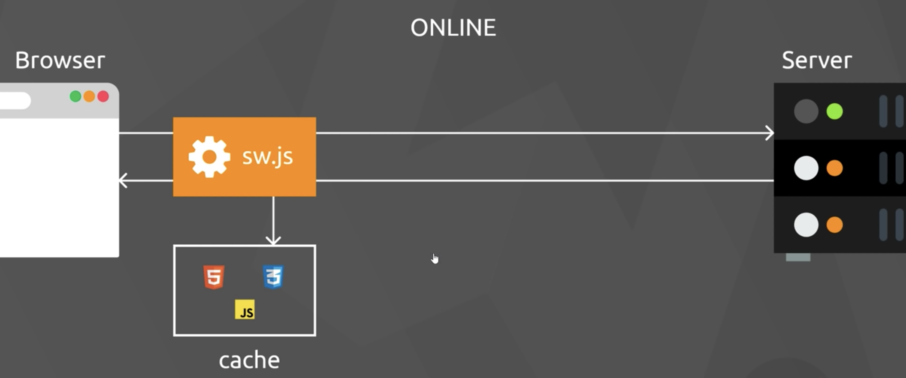
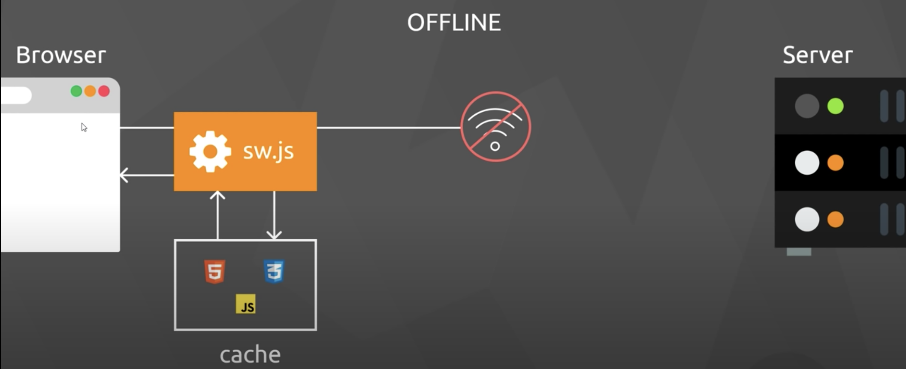

# The Web Developer Bootcamp

## Table of Contents

- [The Web Developer Bootcamp](#the-web-developer-bootcamp)
  - [Table of Contents](#table-of-contents)
  - [Environment and Tools](#environment-and-tools)
  - [HTML](#html)
  - [CSS](#css)
  - [JavaScript](#javascript)
    - [Style Guide](#style-guide)
  - [Popular JS Frameworks](#popular-js-frameworks)
    - [Angular](#angular)
    - [React](#react)
    - [Vue.js](#vuejs)
      - [Useful UI Dependencies](#useful-ui-dependencies)
      - [Nuxt.js](#nuxtjs)
  - [Progressive Web App](#progressive-web-app)
    - [Service Workers](#service-workers)
      - [Lifecycle Events](#lifecycle-events)
    - [Add to Home Screen](#add-to-home-screen)
    - [Offline Browsing](#offline-browsing)
    - [Lighthouse](#lighthouse)
  - [AMP](#amp)
  - [Storage](#storage)
    - [Cookie Storage vs Session Storage vs Local Storage](#cookie-storage-vs-session-storage-vs-local-storage)
    - [IndexedDB](#indexeddb)
  - [Sessions](#sessions)
    - [Stateful, cookie-based authentication](#stateful-cookie-based-authentication)
    - [Stateless, token-based authentication](#stateless-token-based-authentication)
  - [CSR vs SSR](#csr-vs-ssr)
    - [CSR](#csr)
    - [SSR](#ssr)
    - [Pros and cons](#pros-and-cons)
  - [WevSockets](#wevsockets)
    - [Polling and long polling](#polling-and-long-polling)
    - [WebSocket clients](#websocket-clients)
  - [Security Practice](#security-practice)
  - [Micro frontend](#micro-frontend)
    - [Pros and cons](#pros-and-cons-1)
  - [Tooling and Useful Dependencies](#tooling-and-useful-dependencies)
    - [Storybook](#storybook)
    - [Verdaccio](#verdaccio)
      - [Get started](#get-started)
  - [Testing](#testing)
    - [Unit testing](#unit-testing)
    - [Integration testing](#integration-testing)
    - [Automation testing](#automation-testing)
  - [Virtualisation and containers](#virtualisation-and-containers)
  - [Deployment](#deployment)
    - [Vue.js Deployment](#vuejs-deployment)
    - [Nuxt.js Deployment](#nuxtjs-deployment)
    - [React app Deployment](#react-app-deployment)

## Environment and Tools

1. Chrome
2. Node.js
3. Visual Studio Code
4. Useful VS Code tips:
    - If you want to generate some dummy texts, you can type `loren` and hit tab. And if you want to fill in 10 words, for example, you can type `lorem10` and hit tab
    - To copy the whole line and paste right below, you can use `option` + `shift` + down arrow
    - Useful extensions you might need such as Eslint, Prettier, HTML Snippets, Copy Relative Path, Code Spell Checker, Live Server, TabNine.
    - Create your own VS Code settings by hitting `command` + `shift` + `p` to open settings (JSON), and paste the content from [vscode-settings.json](vscode-settings.json)
    - Move up/down the whole line by clicking `option` + up/down arrow
5. Useful Mac keyboard shortcuts:
    - Find and select the next same word: select what word you are looking for, e.g. radio, press `command` + `D`, it will select the next "radio" as well. Then you can modify them at the same time.
    - Move to previous/next word: `option` + left/right arrow
    - Move to the start/end of the sentence: `command` + left/right arrow

## HTML

[Introduction to HTML]

## CSS

[Introduction to CSS]

## JavaScript

For more information, see [JavaScript Tutorials]

### Style Guide

For more information, see [Google JavaScript Style Guide]

## Popular JS Frameworks

For whatever framework you are using, core elements to build a web app are HTML, CSS and Javascript.  
Frameworks help you better integrate with the processing language.

### Angular

### React

### Vue.js

Vue.js demos:

1.  [vue-essentials]
2.  [vue-router]
3.  [nuxt-fundamentals]
4.  [vue-pwa]

#### Useful UI Dependencies

1. [APEXCHARTS.JS]
2. [Element UI]

#### Nuxt.js

Nuxt is a Vue.js-based SSR framework.

Demo: [nuxt-fundamentals]

## Progressive Web App

Research says, 40% of users bounce from sites that take longer than **3 seconds** to load.

-   PWA provides:
    1. Reliable performance: Fast loading, work offline and on flaky networks.
    2. Fast: Smooth animation, jank-free scrolling and seamless navigation.
    3. Engaging: Launch from the home screen and send push notifications.
    4. Push notifications
    5. Homescreen icon metadata
-   PWA speeds up website loading by leveraging service workers to cache assets, but it cannot handle the first visit (where there is no cache).
-   `self::addEventListener`: Inside the service worker, self refers to the service worker itself. Otherwise, it refers to the window object.
-   Use AMP components to improve first visit performance. (AMP allows CDN to cache websites)
-   Precaching: Download and cache files when first run (then always use the cached files).
-   To log if the client goes with PWA, you can set up a specific `"start_url` in `public/manifest.json`.

Go to [PWA] to see how exactly PWA works.

### Service Workers

-   A service worker is a programmable proxy between a web app and the outside, working on other threads which allow a web app to:
    1. Load content offline
    2. Use background sync
    3. Push notifications
-   Lifecycle:
    1. A service worker has lifecycle events independent of the web app.
    2. Create an sw.js (your service worker) in the root directory to allow HTML files to access it globally
    3. Register your sw.js with the browser (You should do this in your app.js file, not in sw.js)
    4. [install event] The browser installs your service worker and running on the service worker thread. This install event only runs once when the service worker is registered
    5. [activate event] If successful, you get an activate event
    6. This service worker starts listening to other events such as `fetch`.
-   Your service worker will not be installed if no changes of sw.js
-   Service workers only work on HTTPS domains, but localhost is an exception to the rule.
-   Service workers are likely the proxy between browser and servers. When your PWA fetch resources from any server, it catches the fetch event.
-   It would be super helpful the have "update on reload" selected during development (In DevTool -> application -> service)
-   To make your Android emulator in `localhost`, In DevTool -> three dots -> More tools -> Remote devices -> Port forwarding -> 5500, localhost:5500 and enabled port forwarding. If you meet all the "Add to Home Screen" criteria, you will see the prompt on your Android device.

#### Lifecycle Events

-   Install:
    -   **If this install event is not triggered, it may be because the service worker has been installed already**.
    -   To install again, you must change this file or in DevTool -> application -> service worker -> Unregister
-   Activate:
    -   If this activating event is not triggered, it may be because the service worker has been installed already.
    -   In DevTool -> application -> service, you will see the service worker is waiting to activate
    -   **Browser does not automatically re-activate installed service**. Two solutions to address are shown below:
        -   Close the tab, and reopen it in another tab.
        -   In DevTool -> application -> service, click on "skip waiting" or have "Update on reload" selected
-   Fetch
    -   This service worker acts as a proxy between the browser and a server.
    -   This event is triggered when your PWA fetch resources from your server
    -   Below is a well-structured fetch request:

```JavaScript
function fetchJSON() {
  fetch('examples/animals.json') // 1
  .then(validateResponse) // 2
  .then(readResponseAsJSON) // 3
  .then(logResult) // 4
  .catch(logError);
}
```

### Add to Home Screen

-   This works when you meet all the [criteria](https://web.dev/install-criteria/)
-   To make your Android emulator in `localhost`, In DevTool -> three dots -> More tools -> Remote devices -> Port forwarding -> 5500, localhost:5500 and enabled port forwarding. If you meet all the "Add to Home Screen" criteria, you will see the prompt on your Android device.

### Offline Browsing




-   Two caches you need to know:
    -   Browser cache: A managed cache. You cannot change it. (In DevTool -> Network -> Disable cache)
    -   Regular cache: This cache could be managed by service workers.

### Lighthouse

-   To trail PWA, there is a tool called Lighthouse built-in Chrome dev tools.
-   Lighthouse reports how well your site or app is doing in performance, accessibility, security, SEO and PWA features.
-   Improve development cycle: Code and Test - Lighthouse - Debug - Lighthouse - Code and Test - ...

## AMP

AMP, Accelerated Mobile Pages. You might use AMP when you need to cache your web app at CDN level.

## Storage

### Cookie Storage vs Session Storage vs Local Storage

|     Storage     | size |   due date   | accessible from |
| :-------------: | :--: | :----------: | --------------- |
| Cookie storage  | 4KB  | Manually set | Any window      |
| Session storage | 5MB  | On tab close | Same tab        |
|  Local storage  | 10MB |    Never     | Any window      |

Notice, `http:mywebsite.com`, `https:mywebsite.com` and `http:mywebsite.com:8080` refer to different session/local storage.

Below are CRUD operations for local storage.

```JavaScript
localStorage.setItem('key', 'value');
localStorage.setItem('key', 'new value');
localStorage.removeItem('key');
localStorage.getItem('key'); // null
```

The APIs of session storage works exactly the same as local storage.

```JavaScript
sessionStorage.setItem('key', 'value');
sessionStorage.setItem('key', 'new value');
sessionStorage.removeItem('key');
sessionStorage.getItem('key'); // null
```

The only way to get cookies is to invoke `document.cookie` and retrieve all the cookies. To remove a cookie, we will need to expire the cookie.

```JavaScript
document.cookie = 'key1=value1; expires=' + new Date(2021, 9, 30).toUTCString();
document.cookie = 'key2=value2; expires=' + new Date(2021, 9, 30).toUTCString();
console.log(document.cookie); // key1=value2; key2=value2
document.cookie = 'key2=value2; expires=' + new Date(2000, 9, 30).toUTCString(); // remove key2
```

### IndexedDB

IndexedDB provides an object store in the browser. It is a non-rational database that stores JS objects, files, blob, etc.

## Sessions

### Stateful, cookie-based authentication

1. The client sends a user authenticates to the server.
2. The server verifies the credentials.
3. The server creates a temporary user session.
4. The server issues a cookie with a session ID and returns `set-cookie:session=sessionstring` within the header.
5. The client sends the cookie with each request. I.e., sending requests with the header `cookie:session=sessionstring`.
6. The server validates it against the session store & grants access.
7. When the user signs out, the server clears its session and cookie.

For servers, each session has to be stored in server side, each user is identified by a session ID.

### Stateless, token-based authentication

The client sends a user authenticates to the server, the server returns a token in the form of JWT. The client then stores that token. It sends requests to the server with a header `authentication: bearer JWT`.

## CSR vs SSR

The client-side rendering downloads HTML files. Before the HTML file gets download, there is a blank page on the browser. Then the browser download and execute the JavaScript files that the HTML file links to. Once all the above tasks have finished, the page becomes interactive and visible. With server-side rendering, once the HTML file has arrived, the browser shows the HTML page. That page is not interactive at that point.

Read more: [A Closer Look at Client-Side & Server-Side Rendering]

### CSR

CSR, client-side rendering means rending content in the browser using JavaScript. A use case is SPA (single page application). Instead of getting all the content from HTML, SPA has small tiny HTML file with JavaScript renders all the rest of the site, such that, webpages can have rich interactions.

### SSR

An example that shows how SSR works in a react app is as follows:

1. Create the app server using frameworks such as `express`.
2. Load the public folder
3. Use express to render the entire look of the index page and convert it to string. You might pass default props to your index without fetching APIs.

Under the hood, SSR first renders the page on the server and send it down as text. Once the page has been rendered on the front-end side, it `hydrate` the webpage, allowing it to be interactive.

### Pros and cons

With CSR, websites have rich interactions and can load parts of the page. The server responds faster than SSR as it does not require extra work, such as converting the page to String. The browser only needs to load a tiny HTML file. After the initial load, it loads fast.

However, CSR has lower SEO potential. While search engine reaches a CSR website, it only finds HTML entities such as <div> and knows nothing about the website's content. Google bots wait a few seconds to take snapshots of each page to index them for SEO. How SEO works on the browser varies from search engine to search engine. Another disadvantage of using CSR is a long initial load. Although CSR gets faster responses from the server than SSR, it has JavaScript that needs to render.

SSR is good at SEO because it is rendered on the server. The time it arrives on the browser has rendered content, which makes SSR exceptional at loading static sites, i.e., websites with a lot of text-based information such as documentation. As SSR sites are rendered on the server to the user, websites are loaded faster most of the time.

SSR must request a new page from the server; the so-called full page reloads, even though most pages look the same. SSR also has slower page rendering as the CPU must perform synchronous jobs such as converting HTML to text. The server is not able to process any request until this has been done. Although webpages appear faster on the browser, users still need to wait for the page to be interactive.

## WevSockets

WebSocket depends on TCP is located at layer 7 (the application layer) in the OSI model. HTTP, SSL, IMAP, POP, etc., are at the same level as well. WebSocket is an HTTP upgrade using TCP connection over `ws://` or `wss://`. It allows the client and server have full-duplex and bi-directional communication. The client and the server communicate in real-time without having to make requests continuously. After the client sends the first HTTP request, the server upgrades the connection to a WebSocket connection. Both parties send data back and forth without the overhead that the HTTP requests may cause.

### Polling and long polling

Polling and long polling are alternatives to WebSockets. Polling is to send an AJAX request every N amount of seconds for new data. Long polling sends requests to the server and keeps the connection open until new data comes in.

### WebSocket clients

```JavaScript
import { io } from 'socket.io-client';

// initialise a socket connection
const socket = io('http://127.0.0.1:5000');

// The socket has an onopen event. Once the protocol has been swapped,
// i.e., upgraded to WebSocket, this function gets invoked.
socket.on('connect', () => {
    socket.emit('client_hello', 'Hello from the client');
});

socket.on('custom_event', (data) => {
    console.log(`received the '${data}' message from the server `);
});

```

Read more: [A beginner's guide to WebSockets]

## Security Practice

[OWASP Secure Headers Project]

## Micro frontend

There are three key pieces of micro frontend architecture: **micro frontends**, an **micro frontend framework** and **host pages**.

### Pros and cons

With the micro frontend, we have better team scalability. We chop up a web app into small micro-apps. Functional teams develop small chunks of code and deploy them independently. That allows the web app to be updated continuously. Moreover, development teams only focus on specific features. In practice, development teams have to dockerise each micro app, making the web app more complex. The pitfall of the micro frontend is that there are no dominant implementations of micro frontend architecture. Moreover, in micro frontend architecture, a host page loads components from various micro-apps. As JavaScript is a single-threaded language, the app would likely encounter runtime issues if some teams mess up their code.

## Tooling and Useful Dependencies

### Storybook

A tool to manage your UI components, make it easier to share components between web apps.  
You can stuff all your components in a storybook project and publish each of them to npm. Use verdaccio if you need a private npm repository.
[vue-storybook]

### Verdaccio

Verdaccio is a lightweight private npm proxy registry that helps you build your private npm registry.

#### Get started

1. You need a running EC2 instance and ssh into it.

```shell
$chmod 0400 test.pem
$ssh -i test.pem ec2-user@52.90.31.225
```

2. Install and launch docker

```shell
$sudo yum update -y
$sudo yum install docker -y
$sudo service docker start

```

3. Pull and run the verdaccio docker image (You can change the first 4873 to whatever port you want, like 80)

```shell
$sudo docker pull verdaccio/verdaccio
$sudo docker run -it --rm --name verdaccio -p 4873:4873 verdaccio/verdaccio
```

4. Back to your EC2 console, add 4873 port as an inbound rule to the security group of the running instance. Then, type `http://YOUR_INSTANCE_PUBLIC_IP:VERDACCIO_PORT` (`http://52.90.31.225:4873/` in this case) in your browser to access your private npm registry.

5. In your computer (where you develop or publish dependencies), update your npm settings

```shell
$npm set registry http://52.90.31.225:4873

```

6. Create a new account

```shell
$npm adduser --registry http://52.90.31.225:4873
```

7. Back to `http://52.90.31.225:4873` to see if you could log in successfully.

8. Publish your node dependency by executing `$npm publish --registry http://52.90.31.225:4873`

9. Pull your dependency by executing `$npm install YOUR_DEPENDENCY_NAME`.

## Testing

Testing includes three main distinct types: unit tests, integration tests and automation tests. Unit tests test individual functions or classes. They are easier and cheapest to implement. Integration tests test how different pieces of code work together. E.g., databases working with a node.js app, a function works with another function. Automation tests, known as UI tests, make sure the expected behaviour on the web is correct.

### Unit testing

Unit tests test pure functions, i.e., deterministic functions, not constructs, including connections between processes, databases, and even functions. Clean, functional components spilt features into small chunks that help with unit testing and lead to maintainable code in the long run.

-   **Testing libraries**: A testing library provides functions or methods that allow developers to test their code. E.g., Jasmine, Jest, MOCHA
-   **Assertion libraries**: An assertion library helps with asserting functions. They are a tool that tests a variable that contains an expected value. E.g., Jasmine, Jest, Chai.
-   **Tester runner**: A test runner allows test scripts to be executed on the browser or a browser-like environment. E.g., Jasmine, Jest, MOCHA, Karma. Karma runs tests on the browser. In practice, we do not run all the tests through the browser except for the tests that require browser APIs. Ideally, when we run tests, it should be speedy. In general, we execute tests once developers save their code. Therefore, other options such as **_Puppeteer_** by Google, a headless browser. That runs your tests faster on regular browsers. **Jsdom**, as its name suggests, is an in-Javascript implementation of the DOM (DOM is a treelike structure that shows the nodes on webpages).
-   **Mocks, spies and stubs**: **_Spies_** provide us information about functions such as how often they are called, in what cases and by whom. **_Stubbing_** replaces selected functions with a function to ensure that the expected behaviour happens. **_Mock_** fakes a function or behaviour to test different parts of the process. E.g., Jasmine, Jest, Sinon.js
-   **Code coverage**: It estimates how many percentage of your code has been tested. E.g., Jest, Istanbul

Jasmine used to be very popular, but it has been taken over by Jest and Mocha combined with Chai and Sinon. Jest has everything in one place. All the above frameworks are behaviour-driven.

### Integration testing

Integration tests are all about cross-communication between different units of code. Mock, spy and stub libraries are implemented in integration tests to expect side effects instead of asserting an output. Compared to unit testing, the downside of integration testing is that integration testing is more expensive and requires more time to write code. As a partition has been changed or broken, you will have to update test cases that depend on those chunks of code. The great cost of integration tests caused small or middle businesses not implementing them very often.

### Automation testing

Automation tests, known as UI tests, are run on the browser or a browser-like environment to simulate user behaviours—tools such as Nightwatch, WebdriverIO, cypress, TestCafé are popular. Many companies instead, hiring testers to do automation tests. UI tests take the longest time amongst the three types of testing we are discussing in this section. Companies might run unit tests and integration tests as long as developers save their work, but they only run UI tests when developers merge their work to the main branch before releasing it to the production.

## Virtualisation and containers

A virtual machine provides a sandbox environment to execute guest operating systems and applications running on top of a host operating system. Similarly, Docker provides containers that allow apps and system libraries to execute distinctly on an OS. Docker guarantees that apps can be executed just like we run the apps on a virtual machine. Imagining containers are a lightweight alternative for machines to virtualise.

## Deployment

### Vue.js Deployment

To build a containerised web app with Nginx, you need to:

1. Add build commands in package.json

```JSON
{
    "scripts": {
        "serve": "vue-cli-service serve",
        "build": "vue-cli-service build",
        "test:unit": "vue-cli-service test:unit",
        "test:e2e": "vue-cli-service test:e2e",
        "lint": "vue-cli-service lint"
    }
}

```

2. Add webpack config in vue.config.js if you need
3. Add Nginx.conf
4. Create Dockerfile and dockerignore

Install Node.js -> Install dependencies -> Run unit testing and linter -> Build node.js app -> Install Nginx -> Configure Nginx

Dockerfile.prod

```Dockerfile
FROM node:latest as prod-build
WORKDIR /app
COPY package*.json ./
RUN npm install
COPY ./ .

RUN npm run test:unit
RUN npm run lint
RUN npm run build

FROM nginx
RUN apt-get update
RUN apt-get install -y nginx-extras
COPY --from=prod-build /app/dist /usr/share/nginx/html/
ADD ./nginx/  /etc/nginx
CMD ["nginx", "-g", "daemon off;"]
```

Dockerfile.staging

```Dockerfile
FROM node:latest as staging-build
WORKDIR /app
COPY package*.json ./
RUN npm install
COPY ./ .

RUN npm run test:unit
RUN npm run lint
RUN npm run dev-build

FROM nginx
RUN apt-get update
RUN apt-get install -y nginx-extras
COPY --from=staging-build /app/dist /usr/share/nginx/html/
ADD ./nginx/  /etc/nginx
CMD ["nginx", "-g", "daemon off;"]
```

dockerignore

```
node_modules/
dist/
```

Notice, a better way to execute the npm install command is when the package.json file changes. Therefore, instead of copying and pasting the whole app, we first copy and paste the package.json file. Because Docker will execute the `RUN npm install` if we make changes above that line of code.

Instead of doing 
```Dockerfile
COPY ./ .
RUN npm install
```
  
We do

```Dockerfile
COPY package*.json ./
RUN npm install
COPY ./ .
```
  
For more information, see [vue-pwa] and [dockerhub](https://hub.docker.com/repository/docker/123987109832/vue-pwa)

### Nuxt.js Deployment

Deploy the Nuxt.js web app in two different ways depending on what model you are using. Static Generated Deployment (Pre-rendered)
and Single Page Application Deployment (SPA) is the same way you deploy a typical vue.js web app.

Server-Side Rendered Deployment (Universal SSR) is a bit different.

1. Add build commands in package.json

```JSON
{
    "scripts": {
        "dev": "nuxt",
        "build": "nuxt build",
        "build:dev": "cross-env NODE_ENV=development nuxt build",
        "start": "cross-env NODE_ENV=production node server/index.js",
        "start:dev": "cross-env NODE_ENV=development node server/index.js",
       "generate": "nuxt generate",
        "lint": "eslint --ext .js,.vue --ignore-path .gitignore .",
        "test": "jest"
    }
}

```

4. Create Dockerfile and dockerignore

Install Node.js -> Install dependencies -> Run unit testing and linter -> Build node.js app -> Start npm

```Dockerfile
FROM node:latest as staging-build
WORKDIR /app
COPY package*.json ./
RUN npm install
COPY ./ .
RUN npm run lint
RUN npm run test
RUN npm run build:dev
ENV HOST 0.0.0.0
EXPOSE 3000
CMD ["npm", "run", "start:dev"]

FROM node:latest as prod-build
WORKDIR /app
COPY package*.json ./
RUN npm install
COPY ./ .
RUN npm run lint
RUN npm run test
RUN npm run build
ENV HOST 0.0.0.0
EXPOSE 3000
CMD ["npm", "run", "start"]
```

dockerignore

```
node_modules/
dist/
./nuxt/
```

For more information, see [nuxt-fundamentals] and [dockerhub](https://hub.docker.com/repository/docker/123987109832/vuejs-nuxtjs-web-app)

### React app Deployment

Check out my [docker react repo](React/docker-react) to read more.

[why rounding odd font sizes to even?]: https://ux.stackexchange.com/questions/129973/why-rounding-odd-font-sizes-to-even
[the 8-point grid system]: https://builttoadapt.io/intro-to-the-8-point-grid-system-d2573cde8632
[html5 semantic elements]: https://guide.freecodecamp.org/html/html5-semantic-elements/
[does url structure affect seo? here's what google thinks]: https://seopressor.com/blog/url-structure-affect-seo/
[seo starter guide]: https://support.google.com/webmasters/answer/7451184?hl=en
[is there an advantage to using rel= "canonical" over a 301 redirect?]: https://www.youtube.com/watch?v=zW5UL3lzBOA
[apexcharts.js]: https://apexcharts.com/
[element ui]: https://element.eleme.io/#/en-US
[js programming language]: JavaScript
[fetch data from the internet via axios]: React%20native/albums/
[login via email]: React%20native/auth/
[redux introduction]: React%20native/tech_stack/
[navigating screens + redux]: React%20native/manager/
[android oreo updates]: React%20native/Oreo
[vue-essentials]: Vue/vue-essentials
[vue-router]: Vue/vue-router
[nuxt-fundamentals]: Vue/nuxt-fundamentals
[verdaccio]: https://verdaccio.org/
[javascript tutorials]: JavaScript/README.md
[google javascript style guide]: https://google.github.io/styleguide/jsguide.html
[rwa gallery]: https://responsive-jp.com/
[pwa]: PWA
[sw.js]: PWA/sw.js
[vue-pwa]: Vue/vue-pwa
[vue-storybook]: Vue/vue-storybook
[introduction to html]: HTML/README.md
[introduction to css]: CSS.md
[a beginner's guide to websockets]: https://www.youtube.com/watch?v=8ARodQ4Wlf4
[owasp secure headers project]: https://wiki.owasp.org/index.php/OWASP_Secure_Headers_Project#tab=Headers
[a closer look at client-side & server-side rendering]: https://www.growth-rocket.com/blog/a-closer-look-at-client-side-server-side-rendering/
