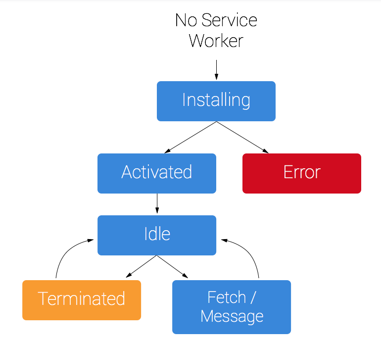

# The Web Developer Bootcamp

## Navigation

-   [Basis](#basis)
    -   [Environment and Tools](#environment-and-tools)
    -   [URL Structure](#url-structure)
    -   [SEO](#seo)
    -   [Redirect](#redirect)
    -   [Reactive Web Applications](#reactive-web-applications)
-   [UI/UX](#ui-ux)
    -   [Responsive Web Design](#responsive-web-design)
    -   [Adaptive Web Design](#adaptive-web-design)
    -   [More resources](#more-resources)
-   [HTML](#html)
-   [CSS](#css)
    -   [SASS and SCSS](#scss-and-scss)
-   [JavaScript](#javaScript)
    -   [Style Guide](#style-guide)
    -   [ECMAScript](#ecmaScript)
-   [Popular Frontend Frameworks](#popular-frontend-framework)
    -   [Angular](#angular)
    -   [React](#react)
    -   [Vue.js](#vuejs)
        -   [Useful UI Dependencies](#useful-ui-dependencies)
        -   [Nuxt.js](#nuxtjs)
-   [Design Patterns](#design-patterns)
    -   [CDD](#cdd)
-   [Progressive Web App](#progressive-web-app)
    -   [Service Workers](#service-workers)
    -   [Lighthouse](#lighthouse)
-   [AMP](#amp)
-   [Tooling and Useful Dependencies](#tooling-and-useful-dependencies)
    -   [Storybook](#storybook)
    -   [Verdaccio](#verdaccio)
-   [Security](#security)
    -   [OWASP Top 10 Web Application Security Risks](#owasp-top-10-web-application-security-risks)
-   [Testing](#testing)
    -   [Unit Testing](#unit-testing)
    -   [End-to-end Testing](#end-to-end-testing)
-   [Deployment](#deployment)
    -   [Vue.js Deployment](#vuejs-deployment)
    -   [Nuxt.js Deployment](#nuxtjs-deployment)

## Basis

### Environment and Tools

1. Chrome
2. Node.js
3. Visual Studio Code
4. Visual Studio Code extensions (Eslint, Beautify, Prettier, Copy Relative Path, Code Spell Checker, Live Server, TabNine, etc.)

### URL Structure

[Does URL Structure Affect SEO? Here’s What Google Thinks]

### SEO

[SEO Starter Guide]

### Redirect

[Is there an advantage to using rel="canonical" over a 301 redirect?]

> If you have access to header modification, use 301, if you don't, then use rel=canonical.

### Reactive Web Applications

[RWA Gallery]

## UI/UX

### Responsive Web Design

### Adaptive Web Design

### More Resources

-   [Why rounding odd font sizes to even?]
-   [The 8-Point Grid System]
-   Image size
    -   Your image size should not be larger than for example, 1200px, it depends on laptops and PCs' screen resolution.
-   [HTML5 Semantic Elements]

## HTML

To see what HTML tags you need to know, see [index.html](index.html)

Tips:

-   With VS Code, instead of write your first HTML file line by line, type `!` and hit enter to create a default HTML code snippet.
-   Install VS Code extension - Live Server, you can right click on your HTML file, and click "Open with Live Server" to exhibit your HTML in your browser.
-   If you want to generate some dummy texts, you can type `lorem` and hit enter. And if you want to fill in 10 words for example, you can type `loren10` and hit enter

## CSS

### SASS and SCSS

## JavaScript

For more information, see [JavaScript Tutorials]

### Style Guide

For more information, see [Google JavaScript Style Guide]

## Popular JS Frameworks

For whatever framework you are using, core elements to build a web app are HTML, CSS and Javascript.  
Frameworks help you better integrate with the processing language.

### Angular

### React

### Vue.js

Vue.js demos:

1.  [vue-essentials]
2.  [vue-router]
3.  [nuxt-fundamentals]
4.  [vue-pwa]

#### Useful UI Dependencies

1. [APEXCHARTS.JS]
2. [Element UI]

#### Nuxt.js

A Vue.js framework

1. Server side rerendering
2. Pre-rerendering
3. Better performance
4. SEO friendly
5. Code splitting

Demo: [nuxt-fundamentals]

## Design Patterns

### CDD

Aka Component-Driven Development.  
A state-of-the-art design pattern for Vue.js

## Progressive Web App

Research says, 40% of users bounce from sites that take longer than **3 seconds** to load.

-   PWA provides:
    1. Reliable: Fast loading, work offline and on flaky networks.
    2. Fast: Smooth animation, jank-free scrolling and seamless navigation.
    3. Engaging: Launch from the home screen and send push notifications.
-   PWA speeds up website loading by leveraging service workers to cache assets, but it cannot handle the first visit (where there is no cache).
-   `self::addEventListener`: Inside the service worker, self refers to the service worker itself, otherwise, it refers to the window object.
-   Use AMP components to improve first visit performance.
-   Precaching: Download and cache files when first run (then always use the cached files).
-   To log if user goes with pwa, you can set up a specific `"start_url` in `public/manifest.json`

Demo: [vue-pwa]

### Service Workers

-   Client side proxy written in JavaScript between your web app and the outside.
-   Cache assets locally.
-   Script:
    -   Lifecycle: install, activate
    -   Intercept network requests: fetch
    -   Receive push message: push
    -   Receive data when idle: sync
-   Service Worker has a lifecycle independently



### Lighthouse

-   To trail PWA, there is a tool called Lighthouse built in Chrome dev tools.
-   Lighthouse reports how well your site or app is doing in terms of performance, accessibility, security, SEO and PWA features.
-   Improve development cycle: Code and Test - Lighthouse - Debug - Lighthouse - Code and Test - ...

## AMP

AMP, Accelerated Mobile Pages.

## CORS

Cross Origin Resource Sharing.

-   Origin: A combination of scheme, host and port. E.g. "http://www.example.com" has scheme "http", port "80" and the host is "www.example.com".
-   In the previous example, if you visit the website with "https", it is a different origin.
-   CORS enables to fetch resources outside from your app's origin.
-   Generally, you can load most resources from different origin, such as images, scripts, video/audio, embeds.
-   You CANNOT load xml and JSON from different origin, unless you grant the permission.
-   Here is the CORS implementation in the nutshell:
    -   Add origin header on request
    -   Server sends `access-control-allow-origin` if allowed
    -   If server does not support CORS:

```Javascript
fetch('https://foo.com/data.json'), {
  mode: 'no-cors' // 'cors' by default
}.then(response => {
  // ...
}).catch(error => {
  // ...
})
```

## Tooling and Useful Dependencies

### Storybook

A tool to manage your UI components, make it easier to share components between web apps.

[vue-storybook]

### Verdaccio

A lightweight private npm proxy registry to help you build your private npm registry.

#### Get started

1. You will need an running EC2 instance, and ssh into it.

```shell
$chmod 0400 test.pem
$ssh -i test.pem ec2-user@52.90.31.225
```

2. Install and start up docker

```shell
$sudo yum update -y
$sudo yum install docker -y
$sudo service docker start
```

3. Pull and run the verdaccio docker image (You can change the first 4873 to whatever port you want, like 80)

```shell
$sudo docker pull verdaccio/verdaccio
$sudo docker run -it --rm --name verdaccio -p 4873:4873 verdaccio/verdaccio
```

4. Back to your EC2 console, add 4873 port as inbound rule to the security group of the running instance. To access your private npm registry, type `http://YOUR_INSTANCE_PUBLIC_IP:VERDACCIO_PORT` (`http://52.90.31.225:4873/` in this case) in your browser.

5. In your computer (where you development or publish dependencies), update your npm settings

```shell
$npm set registry http://52.90.31.225:4873
```

6. Create a new account

```shell
$npm adduser --registry http://52.90.31.225:4873
```

7. Back to `http://52.90.31.225:4873` to see if you could log in successfully.

8. Publish your node dependency by executing `$npm publish --registry http://52.90.31.225:4873`

9. Pull your own dependency by executing `$npm install YOUR_DEPENDENCY_NAME`

## Testing

### Unit Testing

-   Popular frameworks: Jest or Mocha

### End-to-end Testing

-   Popular frameworks: Cypress, Selenium

## Deployment

### Vue.js Deployment

To build a containerised web app with Nginx, you need to:

1. Add build commands in package.json

```JSON
{
    "scripts": {
        "serve": "vue-cli-service serve",
        "build": "vue-cli-service build",
        "test:unit": "vue-cli-service test:unit",
        "test:e2e": "vue-cli-service test:e2e",
        "lint": "vue-cli-service lint"
    }
}
```

2. Add webpack config in vue.config.js if you need
3. Add nginx.conf
4. Create Dockerfile and dockerignore

Install Node.js -> Install dependencies -> Run unit testing and linter -> Build node.js app -> Install Nginx -> Configure Nginx

Dockerfile.prod

```Dockerfile
FROM node:latest as prod-build
WORKDIR /app
COPY package*.json ./
RUN npm install
COPY ./ .

RUN npm run test:unit
RUN npm run lint
RUN npm run build

FROM nginx
RUN apt-get update
RUN apt-get install -y nginx-extras
COPY --from=prod-build /app/dist /usr/share/nginx/html/
ADD ./nginx/  /etc/nginx
CMD ["nginx", "-g", "daemon off;"]
```

Dockerfile.staging

```Dockerfile
FROM node:latest as staging-build
WORKDIR /app
COPY package*.json ./
RUN npm install
COPY ./ .

RUN npm run test:unit
RUN npm run lint
RUN npm run dev-build

FROM nginx
RUN apt-get update
RUN apt-get install -y nginx-extras
COPY --from=staging-build /app/dist /usr/share/nginx/html/
ADD ./nginx/  /etc/nginx
CMD ["nginx", "-g", "daemon off;"]
```

dockerignore

```
node_modules/
dist/
```

For more information, see [vue-pwa] and [dockerhub](https://hub.docker.com/repository/docker/123987109832/vue-pwa)

### Nuxt.js Deployment

Deploy Nuxt.js web app in two different ways depending on what model you are using. Static Generated Deployment (Pre-rendered)
and Single Page Application Deployment (SPA) are basically the same as the way you deploy a typical vue.js web app.

Server-Side Rendered Deployment (Universal SSR) will be a bit different.

1. Add build commands in package.json

```JSON
{
    "scripts": {
        "dev": "nuxt",
        "build": "nuxt build",
        "build:dev": "cross-env NODE_ENV=development nuxt build",
        "start": "cross-env NODE_ENV=production node server/index.js",
        "start:dev": "cross-env NODE_ENV=development node server/index.js",
        "generate": "nuxt generate",
        "lint": "eslint --ext .js,.vue --ignore-path .gitignore .",
        "test": "jest"
    }
}
```

4. Create Dockerfile and dockerignore

Install Node.js -> Install dependencies -> Run unit testing and linter -> Build node.js app -> Start npm

```Dockerfile
FROM node:latest as staging-build
WORKDIR /app
COPY package*.json ./
RUN npm install
COPY ./ .
RUN npm run lint
RUN npm run test
RUN npm run build:dev
ENV HOST 0.0.0.0
EXPOSE 3000
CMD ["npm", "run", "start:dev"]

FROM node:latest as prod-build
WORKDIR /app
COPY package*.json ./
RUN npm install
COPY ./ .
RUN npm run lint
RUN npm run test
RUN npm run build
ENV HOST 0.0.0.0
EXPOSE 3000
CMD ["npm", "run", "start"]
```

dockerignore

```
node_modules/
dist/
./nuxt/
```

For more information, see [nuxt-fundamentals] and [dockerhub](https://hub.docker.com/repository/docker/123987109832/vuejs-nuxtjs-web-app)

[why rounding odd font sizes to even?]: https://ux.stackexchange.com/questions/129973/why-rounding-odd-font-sizes-to-even
[the 8-point grid system]: https://builttoadapt.io/intro-to-the-8-point-grid-system-d2573cde8632
[html5 semantic elements]: https://guide.freecodecamp.org/html/html5-semantic-elements/
[does url structure affect seo? here’s what google thinks]: https://seopressor.com/blog/url-structure-affect-seo/
[seo starter guide]: https://support.google.com/webmasters/answer/7451184?hl=en
[is there an advantage to using rel="canonical" over a 301 redirect?]: https://www.youtube.com/watch?v=zW5UL3lzBOA
[apexcharts.js]: https://apexcharts.com/
[element ui]: https://element.eleme.io/#/en-US
[js programming language]: JavaScript
[fetch data from the internet via axios]: React%20native/albums/
[login via email]: React%20native/auth/
[redux introduction]: React%20native/tech_stack/
[navigating screens + redux]: React%20native/manager/
[android oreo updates]: React%20native/Oreo
[vue-essentials]: Vue/vue-essentials
[vue-router]: Vue/vue-router
[nuxt-fundamentals]: Vue/nuxt-fundamentals
[verdaccio]: https://verdaccio.org/
[javascript tutorials]: JavaScript/README.md
[google javascript style guide]: https://google.github.io/styleguide/jsguide.html
[rwa gallery]: https://responsive-jp.com/
[vue-pwa]: Vue/vue-pwa
[vue-storybook]: Vue/vue-storybook
